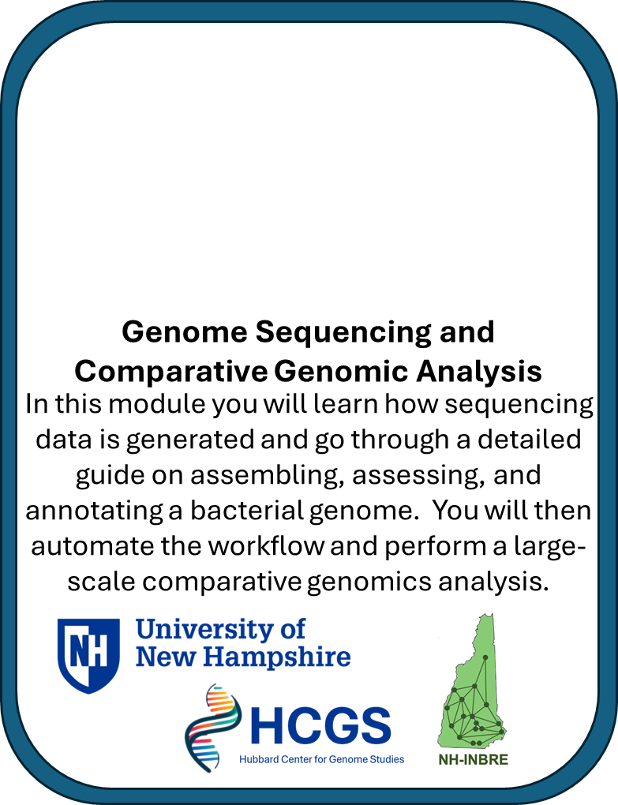
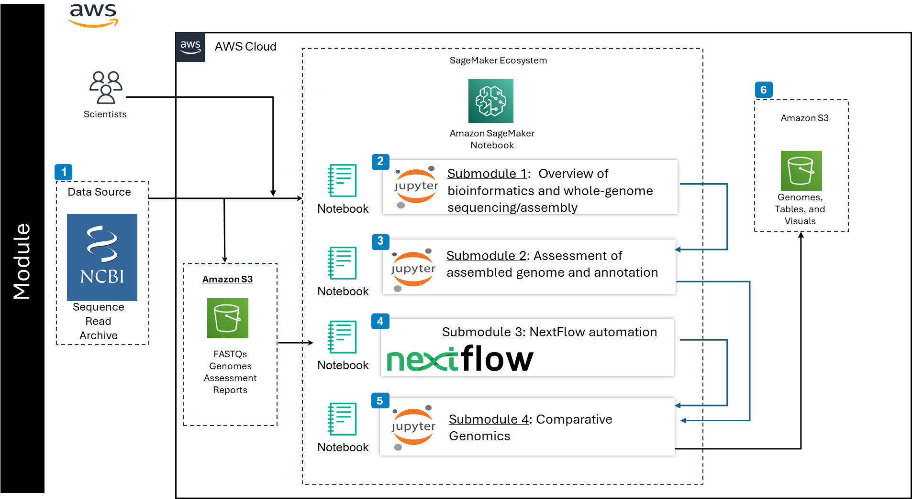

# NH-INBRE - Genome Sequencing and Comparative Genomic Analysis
---------------------------------
## **Contents**

+ [Overview](#overview)
+ [Before Starting](#before-starting)
+ [Getting Started](#getting-started)
+ [Software Requirements](#software-requirements)
+ [Architecture Design](#architecture-design)
+ [Data](#data)
+ [Funding](#funding)
+ [License for Data](#license-for-data)

## **Overview**
This module introduces you to whole-genome sequencing and comparative genomics. You will work with numerous tools to assemble and assess a microbial genome, automate the process on many samples, and utilize the full dataset for comparative genomics analyses.

This module will cost you about $0.00 to run end to end, assuming you shutdown and delete all resources upon completion.

Watch this [Introductional Video]() to learn more about the module.

## **Before Starting**

We suggest starting with the NH-INBRE NIGMS module covering the [Fundamentals of Bionformatics](https://github.com/NIGMS/Fundamentals-of-Bioinformatics) available through the [NIGMS-Sandbox](https://github.com/NIGMS/NIGMS-Sandbox). This module provides a background on working with Jupyter Notebooks and BASH, and covers important bioinformatics file formats that we will use in this module. 

## **Getting Started**

Included here are several submodules or tutorials in the form of Jupyter notebooks. The purpose of these submodules is to help users learn how to perform a comparative genomics analysis. The tutorial focuses on using standard bioinformatic tools in the command-line enviornment. To begin, users will learn how DNA and RNA sequencing data is produced and work through the process of reconstructing an organisms genome (Submodule 1). Users will then learn how to assess a genome for quality and completeness and how to identify genes and other features of interest (Submodule 2). After that users will learn how to automate the workflow using Nextflow and how to incorporate publically available genomic datasets (Submodule 3). Users will then perform a comparative genomic analysis by comparing gene sets and investigating the evolutionary relationships across the genomes (Submodule 4).

For additional technical details on interfacing with the cloud users should reference [NIH Cloud Lab README](https://github.com/STRIDES/NIHCloudLabGCP).

## **Architecture Design**

+ Submodule 1, **Introduction to Genome Sequencing and Assembly** provides an introduction to how genome sequenicng data is generated, with a focus on Illumina next-generation sequenicng platforms. The submodule starts working with the sequencing data, covering the download of data from public repositories, common quality control steps, and ends with assembly of the sequencing data.

+ Submodule 2, **Genome Assessment and Genome Annotation** teaches you how to assess the quality of a *de novo* genome assembly and introduces importantant bionformatic tools and file formars. This is a crucial step to ensure high quality data goes into the comparative genomics module. This submodule ends with a lesson on genome annotation. 

+ Submodule 3, **Workflow Automation and Acquisition of Public Datasets** Reproducability and scalability are crucial in bionformatics, especially in analyses that include large numbers of genome datasets. In this module we process many datasets through the same workflow covered in submodules 1 and 2.

+ Submodule 4, **Comparative Genomics Analysis** The final module combines the output from all other submodules and runs a comparative genomics analysis using the tool Orthofinder. This module includes the generation of the final tables and visualiztions.

## Creating a notebook 

Follow the steps highlighted [here](https://github.com/NIGMS/NIGMS-Sandbox/blob/main/docs/HowToCreateAWSSagemakerNotebooks.md) to create a new notebook in Amazon Sagemaker Studio. Start at the section about a third of the way down called **Set up SageMaker Studio**. Follow steps 1-8 carefully. When setting up the 'Domain' in **step 5** you need to provide a link to a custom container for this project, this is an image that provides the software used throughout the tutorial (see software requirements section below). In this step click on 'Environment' in the top banner followed by 'Attach image' on the right. Attach the custom image container using the URI '009160071907.dkr.ecr.us-east-1.amazonaws.com/unh/custombuilds:1.4'. Provide a name for your image and be sure to change the 'Image type' to 'SageMaker Studio image', provide a kernel name, and click submit.  

Continue on to the section labelled '**Option 1 - JupyterLab**' and follow steps 1-7, be especially careful to stop resources between use, which is highlighted in step 7. In step 4 you will select your machine type, select'**ml.m5.8xlarge**' from the dropdown box, this provides 32 vCPUs and 128 Gb RAM. Increase the **storage to 100 GB**. Be sure to **select the image you created** from the dropdown menu.  

To use our module, open a new terminal window from your notebook instance and clone this repository using `git clone https://github.com/NIGMS/XXXXX`. You can also do this from the top banner by clicking 'Git' followed by 'Git Clone Repo' and pasting in the repository name.

On the left hand side of the page you can then navigate to the directory for this project where you will see this README.md file and several submodules. Double click the first submodule and you can begin the lesson.

Before you begin navigating the submodules you will need to enable extensions in the Jupyter notebook. To do this you can click on the puzzle piece icon  on the left most menu (down the side of the Jupyter notebook) and click on the red button that says **Enable**.  

## **Software Requirements**

Conda installation instructions are provided within each submodule, but prebuilt Docker images are utilized to ensure stability and provide easy access to a set of core bioinformatic analysis tools. Software will be described at the beginning of each submodule. Please see the "software managament" submodule from the [Fundementals of Bionformatics] https://github.com/NIGMS/Fundamentals-of-Bioinformatics) for more details on conda-based installations.

When setting up your notebook, you will utilize a custom Docker image by running it in a container. During the setup process, you selected a prebuilt image (URI: 009160071907.dkr.ecr.us-east-1.amazonaws.com/unh/custombuilds:1.4), which includes all the software you need. This image is configured to ensure that all dependencies are installed and work seamlessly together.

## **Data**

Publicly available data used for the module is focused on antimicrobial resistance (AMR) gene discovery and will be downloaded from the [short-read archive (SRA)](https://www.ncbi.nlm.nih.gov/sra/?term=PRJNA505131) using the NCBIs fastq-dump tool. The publicly available data we download in submodules 1 and 3 are described in a manuscript comparing phenotypic and WGS-derived AMR profiles ([Painset et al. 2020](https://pubmed.ncbi.nlm.nih.gov/31943013/)) and is available under the BioProject accession PRJNA505131.

## **Funding**

The work to create this learning module was supported by the NH-INBRE program and the Center for Integrated Biomedical and Bioengineering Research (CIBBR) through grants from the National Institute of General Medical Sciences of the National Institutes of Health under Award Numbers P20GM103506 and P20GM113131, respectively.

## **License for Data**

Text and materials are licensed under a Creative Commons CC-BY-NC-SA license. The license allows you to copy, remix and redistribute any of our publicly available materials, under the condition that you attribute the work (details in the license) and do not make profits from it. More information is available [here](https://tilburgsciencehub.com/about/#license).

This work is licensed under a [Creative Commons Attribution-NonCommercial-ShareAlike 4.0 International License](http://creativecommons.org/licenses/by-nc-sa/4.0/)
