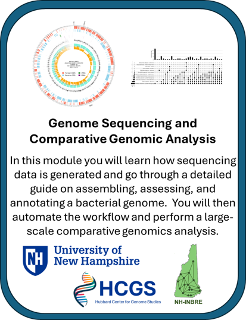

# NH-INBRE - Genome Sequencing and Comparative Genomic Analysis
---------------------------------

Watch this [Introduction Video]() to learn more about the module.

## **Contents**

+ [Overview](#overview)
+ [Background](#background)
+ [Before Starting](#before-starting)
+ [Getting Started](#getting-started)
+ [Software Requirements](#software-requirements)
+ [Architecture Design](#architecture-design)
+ [Data](#data)
+ [Funding](#funding)
+ [License for Data](#license-for-data)

## **Overview**
This learning module will take users through the a detailed bioinformatic tutorial covering whole-genome sequencing, *de novo* genome assembly, assembly assessment, and annotating a microbial genome. The workflow is then automated using a NextFlow workflow to process many samples through the workflow. Finally the full batch of genome datasets are utilized for a compartative genomics analysis.

Please review this document -> https://github.com/NIGMS/NIGMS-Sandbox/blob/main/docs/HowToCreateAWSSagemakerNotebooks.md

## **Background**
This repository contains...

## **Before Starting**

We suggest starting with the NH-INBRE NIGMS module covering the basics of 

## **Getting Started**

Included here are several submodules or tutorials in the form of Jupyter notebooks. The purpose of these submodules is to help users familiarize themselves with the cloud computing environment in the specific context of working with genomics data and software packages to analyze genomics data. These tutorials accomplish this by going step-by-step introducing users to the cloud environment, the terminal interface, the BASH coding language, genomics file formats, the conda software package manager, and methods for mitigating common coding errors. These lessons build familiarity with the terminal environment and set users up to begin working with their own datasets in the terminal environment. For additional technical details on interfacing with the cloud users should reference [NIH Cloud Lab README](https://github.com/STRIDES/NIHCloudLabGCP).

### Creating a user managed notebook 

Follow the steps highlighted [here](https://github.com/STRIDES/NIHCloudLabGCP/blob/main/docs/vertexai.md) to create a new user-managed notebook in Vertex AI. Follow steps 1-8 and be especially careful to enable idle shutdown as highlighted in step 7. For this module you should select Debian 11 and Python 3 in the Environment tab in step 5. In step 6 in the Machine type tab, select n1-standard-4 from the dropdown box.

To use our module, open a new Terminal window from your new notebook instance and clone this repo using `git clone https://github.com/NIGMS/Fundamentals-of-Bioinformatics.git`. Navigate to the directory for this project. You will then see the notebooks in your environment.

Before you begin navigating the submodules you will need to enable extensions in the Jupyter notebook. To do this you can click on the puzzle piece icon  on the left most menu (down the side of the Jupyter notebook) and click on the red button that says **Enable**.  

## **Software Requirements**

Conda and Docker images are utilized within this tutorial to provide easy access to a set of core bioifnormatic analysis tools. These will be installed within each submodule.

fastp

spades

BLAST

bwa

samtools

## **Architecture Design**

+ Submodule 1, **Introduction to genome sequence and assembly** provides an introduction to how genome sequenicng data is generated, with a focus on Illumina next-generation sequenicng platforms. The submodule starts working with the sequencing data, covering the download of data from public repositories, common quality control steps, and ends with assembly of the sequencing data.

+ Submodule 2, **Assembly Assessment and Annotation** teaches you how to assess the quality of a *de novo* genome assembly and introduces importantant bionformatic tools. This is a crucial step to ensure high qulaiyt data goes into the comparative genomics module. This submodule ends with a lesson on genome annotation. 

+ Submodule 3, **NextFlow automation** Reproducability and scalability are crucial in bionformatics, especially in analyses that include large numbers of genome datasets. In this module we process many datasets through the same workflow covered in submodules 1 and 2.

+ Submodule 4, **Comparative Genomics** The final module combines the output from all other submodules and runs a comparative genomics analysis using the tool Orthofinder. This module includes the generation of the final tables and visualiztions.

## **Data**

The sequencing reads used in these lessons were pulled from NCBI using the accession number 

SRR10056829

## **Funding**

The work to create this learnign module was supported by the NH-INBRE program and the Center for Integrated Biomedical and Bioengineering Research (CIBBR) through grants from the National Institute of General Medical Sciences of the National Institutes of Health under Award Numbers P20GM103506 and P20GM113131, respectively.

## **License for Data**

Text and materials are licensed under a Creative Commons CC-BY-NC-SA license. The license allows you to copy, remix and redistribute any of our publicly available materials, under the condition that you attribute the work (details in the license) and do not make profits from it. More information is available [here](https://tilburgsciencehub.com/about/#license).

This work is licensed under a [Creative Commons Attribution-NonCommercial-ShareAlike 4.0 International License](http://creativecommons.org/licenses/by-nc-sa/4.0/)
